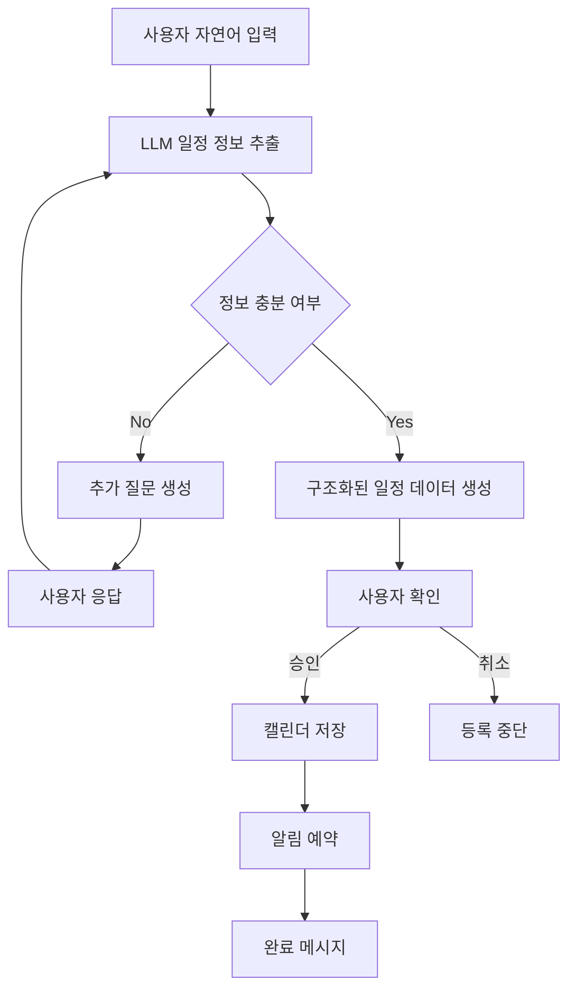
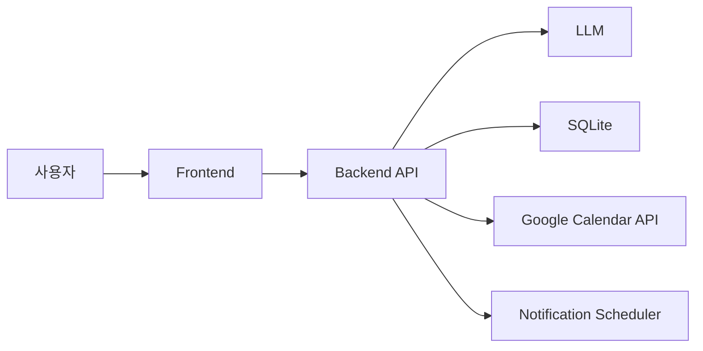

# [10조] 프로젝트 기획서

# 자연어로 말하면 일정과 알람을 자동으로 등록해주는 생활 관리 Agent 서비스

---

# 1. 문제 정의 및 프로젝트 개요

## 1-1. 프로젝트 한 줄 정의

사용자가 자연어로 입력한 일정을 AI Agent가 분석하여 캘린더 등록과 알람 설정까지 자동으로 처리하는 생활 편의형 Agentic Workflow 프로젝트이다.

---

## 1-2. 서비스 한 줄 정의

"내일 오후 3시에 병원 예약, 30분 전에 알람 맞춰줘"처럼 말하면 AI가 일정과 알람을 대신 만들어주는 앱이다.

---

## 1-3. 서비스 선정 배경

일정을 관리하기 위해서는 보통 사용자가 직접 날짜, 시간, 제목, 장소, 알림 시간 등을 하나씩 입력해야 한다. 하지만 실제 생활에서는 일정이 대화처럼 자연스럽게 생긴다.

예를 들어 친구와 약속을 잡거나, 병원 예약을 하거나, 과제 마감일을 듣는 순간 사용자는 머릿속으로는 이미 일정을 알고 있지만, 이를 캘린더 앱에 직접 옮기는 과정은 번거롭다. 이 과정에서 캘린더 등록을 미루거나, 알람을 빼먹거나, 아예 일정을 잊어버리는 문제가 자주 발생한다.

따라서 사용자가 자연어로 일정을 던져주기만 하면 AI Agent가 필요한 정보를 추출하고, 부족한 정보는 되묻고, 최종적으로 캘린더와 알람까지 자동 등록해주는 서비스를 기획하였다.

---

## 1-4. 해결하려는 문제

이 프로젝트가 해결하려는 핵심 문제는 일정 등록과 알람 설정 과정의 번거로움이다. 현재 사용자는 일정을 등록하기 위해 다음과 같은 과정을 직접 수행해야 한다.

- 캘린더 앱 실행
- 날짜 선택
- 시작 시간과 종료 시간 입력
- 일정 제목 입력
- 장소 입력
- 알림 시간 선택
- 저장 버튼 클릭
- 필요하면 별도로 알람 앱까지 실행

이 과정은 단순하지만 반복적으로 발생하면 피로도가 높다. 특히 바쁜 상황에서는 "나중에 등록해야지"라고 생각했다가 잊어버리는 일이 생긴다.

또한 사용자가 실제로 기억하는 일정 정보는 보통 다음과 같이 자연어 형태이다.

- "다음 주 월요일 오전 10시에 회의 있어."
- "오늘 저녁 7시에 헬스장 가야 해. 1시간 전에 알려줘."
- "금요일 자정까지 과제 제출해야 돼."

하지만 기존 캘린더 앱은 이런 문장을 바로 일정으로 바꾸는 데 한계가 있다. 따라서 본 프로젝트는 자연어 일정을 구조화된 일정 데이터로 변환하고, 캘린더 등록 및 알람 예약까지 연결하는 것을 목표로 한다.

---

## 1-5. 대상 사용자

이 서비스의 주요 대상 사용자는 일정은 많지만 캘린더와 알람을 직접 관리하는 데 불편함을 느끼는 사용자이다.

구체적인 대상 사용자는 다음과 같다.

- 과제, 시험, 약속, 동아리 일정이 많은 대학생
- 회의, 미팅, 마감 일정이 많은 직장인
- 병원 예약, 운동, 약속, 개인 업무를 자주 잊는 일반 사용자
- 캘린더 앱 사용은 필요하지만 직접 입력하는 과정을 귀찮아하는 사용자
- 자연어 입력으로 빠르게 일정 관리를 끝내고 싶은 사용자

---

## 1-6. 핵심 가치

이 프로젝트의 핵심 가치는 **"한 문장 입력으로 일정 관리 완료"** 이다.

사용자는 복잡한 입력 과정을 거치지 않고, 평소 말하듯이 일정을 입력하기만 하면 된다. Agent는 사용자의 문장에서 날짜, 시간, 일정명, 장소, 알림 조건을 추출하고, 필요한 경우 추가 질문을 통해 일정을 완성한다.

이를 통해 사용자는 다음과 같은 이점을 얻을 수 있다.

- 일정 등록에 드는 시간을 줄일 수 있다.
- 알람 설정을 빼먹는 일을 줄일 수 있다.
- 캘린더를 꾸준히 관리하는 부담을 낮출 수 있다.
- 자연어 입력만으로 생활 일정을 자동화할 수 있다.

---

# 2. 사용자 및 Agent 설계

## 2-1. 타깃 사용자 페르소나

### 페르소나 A: 대학생 사용자

- 이름: 김민수
- 상황:
  - 과제, 시험, 팀플 일정이 많음
  - 일정은 머릿속으로 기억하지만 등록을 자주 미룸
- 불편함:
  - 마감일을 깜빡함
  - 알람 설정을 자주 놓침
- 니즈:
  - 빠르게 일정 등록
  - 자연어 기반 일정 관리

### 페르소나 B: 직장인 사용자

- 이름: 이지은
- 상황:
  - 회의, 미팅, 병원 예약, 개인 일정이 많음
  - 업무 중 캘린더 입력 과정이 번거로움
- 불편함:
  - 일정 등록 자체가 귀찮음
  - 알람 설정을 자주 누락
- 니즈:
  - 최소 입력으로 일정 관리
  - 일정 + 알람 자동화

---

## 2-2. Agent의 역할

이 프로젝트에서 Agent는 단순히 대답만 하는 챗봇이 아니라, 사용자의 자연어 입력을 실제 일정 관리 행동으로 연결하는 실행형 Agent이다.

Agent의 구체적인 역할은 다음과 같다.

- 자연어 문장에서 일정 정보 추출
- 날짜·시간·일정명·알람 시간 구조화
- 정보 부족 시 추가 질문 수행
- 최종 등록 내용 요약
- 사용자 확인 후 캘린더 등록
- 알림 예약 실행
- 등록 완료 메시지 제공

---

## 2-3. Agent의 성격 및 톤앤매너

Agent는 사용자의 일정을 대신 정리하고 실행을 도와주는 간결한 생활 비서형 Agent를 지향한다.

사용자가 빠르게 일정을 등록하고 싶어 하는 상황에서 사용하는 서비스이므로, 불필요하게 긴 설명보다는 핵심 정보만 명확하게 정리해주는 톤이 적합하다.

Agent의 말투는 친절하되 과하게 감성적이지 않고, 사용자가 입력한 일정을 다음 행동으로 바로 이어갈 수 있도록 실용적으로 안내한다.

특히 일정 등록 전에는 날짜, 시간, 일정명, 알림 시간을 한눈에 확인할 수 있게 요약하고, 사용자의 확인을 받은 뒤에만 실행한다.

### 톤앤매너 원칙

- 불필요하게 긴 설명은 하지 않는다.
- 등록 전 핵심 정보를 명확하게 확인한다.
- 애매한 정보가 있으면 추측하지 않고 질문한다.
- 사용자가 급하게 입력해도 자연스럽게 정리해준다.
- 말투는 부드럽고 실용적으로 유지한다.

### 예시 톤

- "내일 오후 3시 병원 일정으로 등록할게요."
- "알림은 30분 전에 설정할까요?"
- "시간 정보가 없어요. 몇 시 일정인가요?"

---

## 2-4. Agent의 자율성 범위

Agent는 사용자의 편의를 위해 일정 정보를 자동으로 분석하지만, 중요한 실행 전에는 사용자 확인을 거치는 방식으로 설계한다.

### Agent가 자동 수행하는 것

- 자연어 일정 분석
- 날짜/시간 파싱
- 기본 알람 추천
- 일정 요약 생성

### 사용자 확인이 필요한 것

- 실제 캘린더 등록
- 알람 최종 설정
- 애매한 날짜 해석
- 일정 수정/삭제

---

# 3. 핵심 기능 및 사용자 흐름

## 3-1. 주요 사용자 시나리오

### 시나리오 1: 일정과 알림을 한 번에 등록하는 경우

#### 사용자 입력

> "이번 주 토요일 오후 6시에 홍대에서 친구 만나. 1시간 전에 알려줘."

#### Agent 처리 흐름

1. 날짜·시간·장소·알림 시간 추출
2. 일정 요약 생성
3. 사용자 확인 요청
4. 캘린더 등록
5. 알림 예약

---

### 시나리오 2: 정보가 부족한 경우

#### 사용자 입력

> "내일 병원 가는 거 알림 맞춰줘."

#### Agent 응답

> "내일 병원 일정으로 등록할게요. 몇 시 일정인가요?"

#### 사용자 답변

> "오후 3시."

#### Agent 응답

> "내일 오후 3시에 '병원 방문' 일정을 등록하고, 기본 알림은 30분 전으로 설정할게요. 이대로 등록할까요?"

---

### 시나리오 3: 마감 일정 등록

#### 사용자 입력

> "금요일 밤 12시까지 프로젝트 기획서 제출해야 해."

#### Agent 처리 흐름

- 마감 일정으로 인식
- 종료 시점 기반 일정 생성
- 기본 알림 설정
- 사용자 확인 후 등록

---

## 3-2. 핵심 기능 정의

| 기능             | 설명                                 |
| ---------------- | ------------------------------------ |
| 자연어 일정 입력 | 사용자가 말하듯 일정 입력            |
| 일정 정보 추출   | 날짜·시간·일정명·장소·알림 시간 파싱 |
| 추가 질문 처리   | 부족한 정보가 있으면 질문            |
| 등록 전 요약     | 최종 등록 내용 확인                  |
| 캘린더 등록      | 일정 저장                            |
| 알림 예약        | 알람 자동 생성                       |
| 등록 완료 응답   | 최종 결과 안내                       |

---

## 3-3. 워크플로우

### 사용자 관점 워크플로우

1. 앱 실행
2. 자연어로 일정 입력
3. Agent가 일정 정보를 분석
4. 정보가 부족하면 Agent가 추가 질문
5. Agent가 최종 등록 내용 요약
6. 사용자가 등록 여부 확인
7. 캘린더에 일정 등록
8. 알림 예약
9. 등록 완료 메시지 표시

---

### 시스템 관점 워크플로우



---

# 4. 기술 구현 설계

## 4-1. 기술 스택

| 영역        | 기술                |
| ----------- | ------------------- |
| Frontend    | React Native        |
| Backend     | FastAPI             |
| LLM         | OpenAI API          |
| Database    | SQLite              |
| 캘린더 연동 | Google Calendar API |
| 알림        | Local Notification  |
| 배포        | apk, ipa            |

---

## 4-2. 시스템 아키텍처



---

## 4-3. 프롬프트 설계 전략

프롬프트 설계의 핵심은 Agent가 자유롭게 대답하는 것이 아니라, 일정 등록에 필요한 정보를 안정적으로 추출하도록 제한하는 것이다.

### 전략

- JSON 형식 강제
- 날짜·시간·일정명 필드 분리
- 정보 부족 여부 판단
- 누락 정보 질문 유도
- 일정 등록 전 요약 생성

### 예시 출력 형식

```json
{
  "title": "병원 방문",
  "date": "2026-05-10",
  "time": "15:00",
  "alarm": "30m_before",
  "missing_fields": []
}
```

---

## 4-4. 데이터 활용 및 기억 관리

MVP에서는 최소한의 데이터만 저장한다.

### 저장 데이터

- 일정명
- 날짜
- 시간
- 알림 시간
- 생성 시간

### 저장하지 않는 것

- 장기 대화 메모리
- 사용자 행동 분석
- 개인화 추천 데이터

---

## 4-5. 제약사항 및 예외 처리

### MVP 제약사항

- 모바일 푸시 알림은 MVP 범위에서 제외
- 복잡한 반복 일정 (매주·3개월 등) MVP 범위에서 제외
- 기존 일정 수정 및 삭제는 MVP 범위에서 제외
- 여러 캘린더 간 동기화는 MVP 범위에서 제외
- 사용자 승인 없는 자동 등록 제외

---

### 예외 처리

| 상황           | 처리 방식      |
| -------------- | -------------- |
| 날짜 정보 없음 | 추가 질문      |
| 시간 정보 없음 | 추가 질문      |
| 애매한 표현    | 사용자 확인    |
| 알림 미입력    | 기본 알림 적용 |
| 잘못된 날짜    | 재입력 요청    |

---

# 5. 성과 평가 및 실행 계획

## 5-1. 성공 지표 KPI

| KPI                   | 목표          |
| --------------------- | ------------- |
| 일정 등록 성공률      | 90% 이상      |
| 일정 정보 추출 정확도 | 85% 이상      |
| 추가 질문 최소화      | 평균 1회 이하 |
| 등록 완료 시간        | 30초 이내     |

### 데모 성공 기준

아래 입력에 대해 Agentic Workflow가 정상 작동하면 MVP 성공으로 본다.

- "내일 오후 3시 병원 예약"
- "금요일 자정까지 과제 제출"
- "다음 주 월요일 오전 10시 회의"

---

## 5-2. MVP 범위

### MVP에 포함되는 기능

- 채팅형 자연어 입력 화면
- 일정 정보 추출
  - 일정명
  - 날짜
  - 시간
  - 알림 시간
- 부족한 정보 확인
- 등록 전 요약 및 사용자 확인
- 캘린더 등록
  - Google Calendar API 또는 로컬 SQLite
- 로컬 알림 예약
  - 데스크톱 알림 또는 콘솔 알림
- 등록 완료 메시지

---

### MVP에서 제외되는 기능

- 모바일 앱 개발
- 실제 모바일 푸시 알림
- 음성 입력
- 반복 일정 고급 처리
- 기존 일정 수정 및 삭제
- 여러 캘린더 계정 동기화
- 일정 공유
- 사용자의 하루 일정 자동 최적화
- 장기 메모리 기반 개인화 추천

---

## 5-3. 단계별 개발 로드맵

| 단계  | 내용                          |
| ----- | ----------------------------- |
| 1주차 | 요구사항 정리 및 기본 UI 구성 |
| 2주차 | 자연어 일정 추출 기능 구현    |
| 3주차 | 추가 질문 및 Workflow 연결    |
| 4주차 | 캘린더 저장 및 알림 기능 구현 |
| 5주차 | 예외 처리 및 UX 개선          |
| 6주차 | 데모 제작 및 발표 준비        |

---

## 5-4. 기대 효과

- 자연어 기반 일정 관리 경험 제공
- 일정 등록 피로도 감소
- 알람 누락 감소
- 캘린더 활용 습관 개선
- Agentic Workflow 구조 학습 및 구현 경험 확보

---

# 최종 요약

본 프로젝트는 사용자가 자연어로 입력한 일정을 AI Agent가 이해하고, 필요한 정보를 확인한 뒤, 캘린더 등록과 알림 예약까지 수행하는 생활 편의형 Agent 서비스이다.

MVP에서는 로컬 환경에서 실행 가능한 데모를 목표로 하며, 다음 흐름의 Agentic Workflow를 구현한다.

- 자연어 입력
- 일정 정보 추출
- 추가 질문
- 등록 전 확인
- 캘린더 저장
- 로컬 알림 예약

이를 통해 사용자는 복잡한 캘린더 입력 과정을 거치지 않고, 자연어 한 문장만으로 일정 관리 자동화를 경험할 수 있다.
