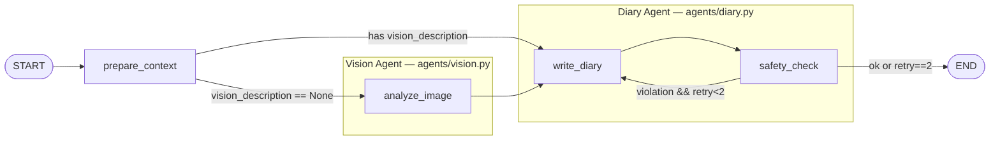
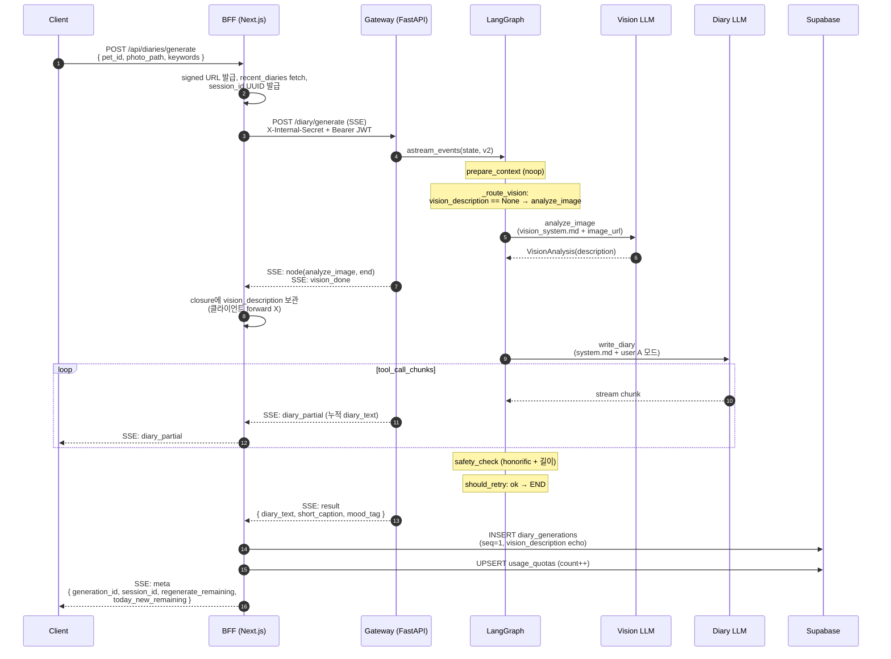
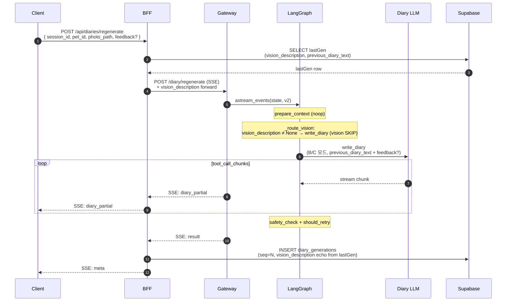
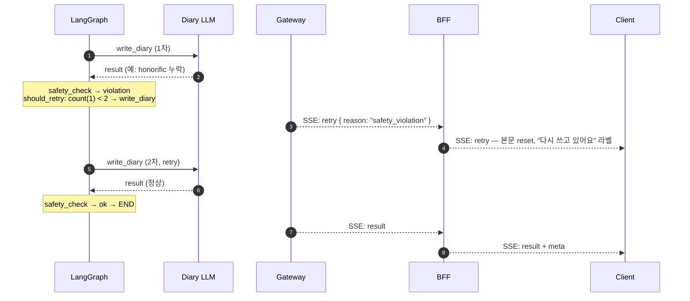

# LangGraph 아키텍처 (ai-gateway)

> 사진 + 키워드 → 1인칭 일기 생성. FastAPI endpoint가 graph를 invoke.
> 소스: `apps/ai-gateway/src/ai_gateway/{graph,state,prompts_loader,contracts}.py`,
> `apps/ai-gateway/src/ai_gateway/agents/{vision,diary}.py`

## 1. 토폴로지

- 컴파일은 `get_diary_graph()` (lru_cache로 1회만 build)
- TypedDict reducer는 **overwrite** — 노드는 변경한 필드만 dict로 반환
- vision/diary는 **모듈로 캡슐화된 2개 Agent**. state는 단일 `DiaryState` 공유.
- retry edge는 `write_diary`로만 돌아감 — 사진 토큰은 vision agent에서 1회만 소비.
- **regenerate 시 vision skip**: BFF가 직전 generation의 `vision_description`을 forward하면 prepare_context 다음 conditional edge가 analyze_image를 건너뛴다. 같은 session 내 photo는 동일하므로 묘사 재호출 비용 절약 + 응답 시간 ≈6초 단축.

## 2. 노드

| 노드 | 모듈 | 책임 | 출력 필드 |
|---|---|---|---|
| `prepare_context` | `graph.py` (inline) | 입력 sanity 훅 (현재 noop, Pydantic 검증으로 충분) | — |
| `_route_vision` (conditional edge) | `graph.py` | `state.vision_description` 있으면 `write_diary`, 없으면 `analyze_image` | — |
| `analyze_image` | `agents/vision.py` | 사진 → 한국어 시각 묘사 1단락 (객체·자세·표정·배경, 정서 추론 허용) | `vision_description` |
| `write_diary` | `agents/diary.py` | system/user 메시지 조립 → GPT-4o-mini 호출 (text-only) → structured output 파싱 | `diary_text`, `short_caption`, `mood_tag`, `safety_retry_count++` |
| `safety_check` | `agents/diary.py` | 호칭 substring + 길이 검증 | `safety_violation` |
| `should_retry` (conditional edge) | `agents/diary.py` | violation && `safety_retry_count < 2` → `write_diary`, else END | — |

**안전 retry 상한**: `SAFETY_MAX_CALLS = 2` (첫 호출 + retry 1회). 의미는 "write_diary 호출 횟수". state 내부 카운터, DB 영속 X.

## 3. State 스키마 (`DiaryState`)

| 그룹 | 필드 |
|---|---|
| 메타 | `session_id`, `seq` (1~4) |
| 입력 | `pet_id`, `honorific`, `species`, `gender`, `photo_signed_url`, `keywords`, `recent_diaries[≤3]` |
| 재생성 (seq≥2) | `previous_diary_text?`, `regen_feedback?` |
| Vision 산출 | `vision_description?` |
| 출력 | `diary_text?`, `short_caption?`, `mood_tag?` |
| 안전 메타 | `safety_retry_count`, `safety_violation?` |

`vision_description`은 **session 단위로 영속화**됨 — `diary_generations.vision_description` 컬럼에 매 row echo 저장. seq=1 generation이 vision LLM 호출하여 채우고, seq≥2 regenerate에선 BFF가 lastGen에서 SELECT해서 gateway로 forward → graph가 analyze_image skip. 클라이언트 응답 body엔 노출 안 함 (graph 내부 정보).

## 4. Vision Agent (`agents/vision.py`)

- **모델**: `gpt-4o-mini`, `temperature=0.2` (재호출 간 묘사 흔들림 최소화)
- **Structured output**: `.with_structured_output(VisionAnalysis)`
  - `description: str` 100~600자 (prompt 권장 200~400, Pydantic은 outlier 차단용)
- **메시지**: SystemMessage(`vision_system.md` fill) + HumanMessage([짧은 instruction text + `image_url` (signed URL, `detail="low"`)])
- 싱글톤: `_vision_llm()` (lru_cache)

## 5. Diary Agent (`agents/diary.py`)

- **모델**: `gpt-4o-mini`, `temperature=0.7`
- **Structured output**: `.with_structured_output(DiaryGenerationResult)` — Pydantic으로 schema 강제
  - `diary_text` 50~1000자, `short_caption` 1~100자, `mood_tag` ∈ 7-enum (`행복/신남/평온/졸림/심심/슬픔/까칠`)
- **메시지**: SystemMessage(`system.md` fill) + HumanMessage(text only — 사진 직접 안 봄)
- 싱글톤: `_diary_llm()` (lru_cache)

## 6. 프롬프트 조립 (`prompts_loader`)

소스: `prompts/diary_v1/{vision_system.md, system.md, user_template.md, tone_guide.md}` — import 시 1회 read.

**Vision system 메시지** (`build_vision_system_message`): `vision_system.md` placeholder fill
- `{{ species_raw }}`, `{{ gender }}` — 호칭/톤은 vision 책임 X

**Diary system 메시지** (`build_system_message`): `system.md` placeholder fill
- `{{ tone_common }}` ← tone_guide §0
- `{{ tone_species }}` ← §1(cat) / §2(dog) / §3(other) — `normalize_species()`로 분기
- `{{ species_raw }}`, `{{ gender }}`, `{{ honorific }}`

**Diary user 메시지** (`build_user_message`): 모드 A/B/C 중 1개 선택 후 placeholder fill
- `seq==1` → **A** (신규 생성)
- `seq≥2 && feedback 있음` → **B** (피드백 기반 재생성)
- `seq≥2 && feedback 없음` → **C** (단순 재생성)
- 공통 placeholder: `{{ vision_description }}`, `{{ keywords }}`, `{{ recent_diaries_block }}`
- B/C: `{{ previous_diary_text }}`, B만: `{{ regen_feedback }}`

## 7. 엔트리 (`main.py`)

| Endpoint | seq | 모드 |
|---|---|---|
| `POST /diary/generate` | 1 | A |
| `POST /diary/regenerate` | 2~4 | B / C |

- 미들웨어: `internal_secret_middleware` (outer) → `jwt_middleware` (inner) → endpoint
- `_initial_state(req)`로 DiaryState 빌드. regenerate request에 `vision_description` 있으면 그대로 forward(graph가 skip), 없으면 None
- LangSmith trace config: `metadata={session_id, seq, owner_id_hash(SHA256[:16])}`, `tags=[seq:N]`, `run_name=diary_generate|diary_regenerate`
- 응답은 SSE stream (`text/event-stream`). `analyze_image` 끝나면 `vision_done` event emit (BFF가 가로채서 DB echo, 클라이언트엔 forward 안 함). 최종 `result` event로 `DiaryGenerationResult` 3 필드 emit

## 8. SSE 이벤트 흐름 (Client ↔ BFF ↔ Gateway ↔ LLM ↔ DB)

Gateway는 SSE StreamingResponse로 6종 이벤트를 emit하고 BFF가 mediator로 가공. 이벤트 union은 `packages/shared-types/src/stream.ts` 단일 진실 소스. 자세한 결정은 ADR-0008 부록·ADR-0011 부록(2026-05-05).

### 8.1 generate (seq=1) — vision LLM 호출

### 8.2 regenerate (seq≥2) — vision LLM **skip**

> 효과: regenerate 호출당 vision LLM 1회 절감, 응답 시간 ≈6초 단축. legacy row(`vision_description IS NULL`)는 다음 regenerate에서 self-heal.

### 8.3 safety retry 1회 (write_diary 본문 reset)

> `retry` 이벤트는 `write_diary` node start가 2번째일 때만 emit (false trigger 방지: `event["name"] == "write_diary"` 조건으로 sub-runnable propagation 무시).

## 9. 이벤트 union (실측)

| type | 발신자 | 의미 |
|---|---|---|
| `node` | gateway | graph 노드 시작/종료 (UI 라벨 전환) |
| `vision_done` | gateway | analyze_image 산출. **BFF 종결**, 클라이언트 미수신 |
| `diary_partial` | gateway | write_diary 누적 diary_text (매번 전체) |
| `retry` | gateway | safety violation → 본문 reset |
| `result` | gateway | 최종 산출 (text/caption/mood) |
| `meta` | BFF | INSERT 후 generation_id/session_id/카운터 |
| `error` | gateway/BFF | 종료 신호 |

클라이언트는 `meta`까지 받아야 generation 확정 (없으면 INSERT 실패 ⇒ 채택/재생성 차단).

## 10. 관련 ADR

- ADR-0003: 모델 선택 (gpt-4o-mini Vision)
- ADR-0005: graph 토폴로지 + state schema (부록 v2 2026-05-05 — vision/diary 분리 + skip 분기)
- ADR-0006: 보안 경계 (`X-Internal-Secret` + Bearer JWT)
- ADR-0007: 영속화 모델 (vision 산출 echo 정책 포함)
- ADR-0008: BFF API 표면 (부록 v2 — SSE + mediator 패턴)
- ADR-0010: DB CHECK 길이 제약 (`vision_description` 컬럼 포함)
- ADR-0011: endpoint 시그니처 + 환경변수 (부록 v2 — SSE + regenerate body `vision_description?`)
- ADR-0012: LangSmith trace 메타 PII 회피
- ADR-0013: 종 이모지/키워드 매핑
