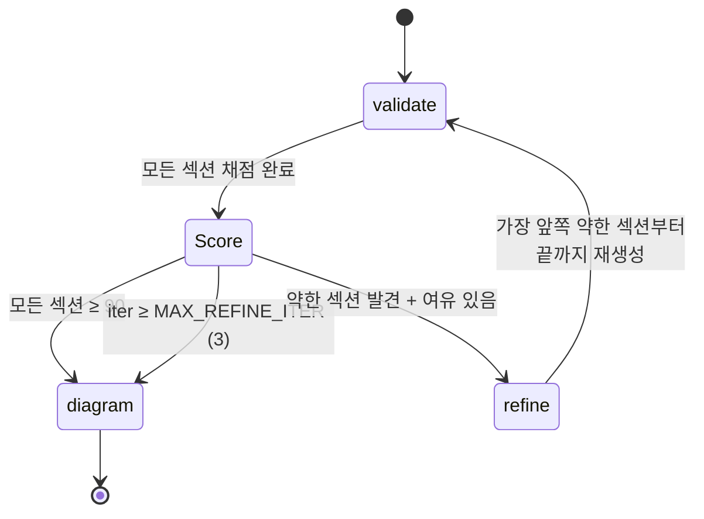

# GitHub → 포트폴리오

GitHub 레포 하나 → AI가 4섹션 작성 → 채점·재생성 → 시스템 아키텍처 + 데이터플로우 다이어그램 → 최종 머지 → 6가지 템플릿 중 선택 → **Notion 발행 또는 PDF 저장** (둘 다 가능).

## 전체 워크플로우 다이어그램

폴더·서비스·툴·점수 라우팅이 한 그림에:

```mermaid
flowchart TD
  User([👤 사용자])

  %% --- 입력 ---
  User -- "GitHub URL · PAT · Notion Token · 추가 정보" --> Front["🖥 static/index.html<br/><i>입력 폼</i>"]
  Front -- "POST /api/session" --> API["⚙️ src/api/routes/session.py<br/><i>create()</i>"]
  API --> SM["📦 src/services/session_manager.py<br/><i>Session 생성 (state machine)</i>"]
  SM --> Graph[["🔀 src/services/orchestrator.py<br/><b>LangGraph StateGraph</b>"]]

  %% --- 노드 흐름 ---
  Graph --> N1["fetch_node<br/>📂 services/github_loader.py"]
  N1 -. PyGithub .-> GH[(GitHub API)]
  N1 --> N2["compress_node<br/>📂 services/context_builder.py"]
  N2 -. low .-> LLM[[Upstage Solar Pro 3]]

  N2 --> N3["interview_node<br/>📂 agents/interview_agent.py"]
  N3 -. low .-> LLM
  N3 --> Q{질문 0~3개?}
  Q -- "있음" --> WAIT["⏸ INTERRUPT<br/>사용자 답변 대기"]
  WAIT -- "POST /api/session/&#123;sid&#125;/answers" --> User2([👤 답변])
  User2 --> MA["merge_answers_node"]
  Q -- "없음" --> MA

  %% --- 4섹션 병렬 + 툴콜 ---
  MA --> Gen["generate_node — 병렬 4"]
  subgraph PAR ["🧵 ThreadPoolExecutor (4-way)"]
    direction LR
    A1["🤖 problem_agent<br/>📂 agents/problem_agent.py"]
    A2["🤖 status_agent<br/>📂 agents/status_agent.py"]
    A3["🤖 cause_agent<br/>📂 agents/cause_agent.py<br/><i>predictor + writer 2-LLM</i>"]
    A4["🤖 result_agent<br/>📂 agents/result_agent.py"]
  end
  Gen --> A1 & A2 & A3 & A4

  %% --- 툴 사용 ---
  subgraph TOOLS ["🛠 src/tools/section_helpers.py — bind_tools"]
    direction TB
    T1[extract_repo_metadata]
    T2[detect_tech_stack]
    T3[summarize_directory_tree]
    T4[summarize_commits_by_topic]
    T5[find_bugfix_commits]
    T6[find_perf_commits]
    T7[parse_changelog]
    T8[read_file]
    T9[search_code]
  end
  A1 -. tool calling .-> T1 & T8 & T9
  A2 -. tool calling .-> T2 & T3 & T8 & T9
  A3 -. tool calling .-> T4 & T5 & T8 & T9
  A4 -. tool calling .-> T6 & T7 & T8

  A1 -. low .-> LLM
  A2 -. low .-> LLM
  A3 -. high .-> LLM
  A4 -. low .-> LLM

  %% --- 채점 + 라우터 ---
  PAR --> Val["validate_node<br/>📂 agents/validator_agent.py"]
  Val -. high .-> LLM
  Val --> Score{🏁 라우터<br/>섹션별 ≥ 90?<br/>iter &lt; 3?}
  Score -- "약한 섹션 < 90 + 여유" --> Refine["refine_node<br/><i>weakest부터 cascade 재생성</i>"]
  Refine --> Val
  Score -- "통과 / 한도 도달" --> Diag["diagram_node"]

  %% --- 다이어그램 + 머지 ---
  Diag --> AA["🤖 architecture_agent<br/>📂 agents/architecture_agent.py<br/>→ Mermaid"]
  Diag --> DA["🤖 dataflow_agent<br/>📂 agents/dataflow_agent.py<br/>→ Mermaid"]
  AA -. high .-> LLM
  DA -. high .-> LLM
  AA --> Merge["merge_node<br/>📂 agents/merge_agent.py<br/><i>(deterministic — LLM X)</i>"]
  DA --> Merge

  %% --- 템플릿 + 발행 ---
  Merge --> Ready["READY_FOR_TEMPLATE"]
  Ready -- "GET /api/session/&#123;sid&#125;/templates" --> Pick["🎨 6개 템플릿 카드<br/>📂 src/templates/<br/>minimal · detailed · troubleshooting<br/>cover · project_record · star"]
  Pick -- "📝 Notion 선택 + POST /publish" --> Pub["📂 services/notion_publisher.py"]
  Pick -- "📄 PDF 선택 + POST /export-pdf" --> Pdf["📂 services/pdf_publisher.py<br/>md → HTML → PDF<br/>(Mermaid → Kroki PNG)"]
  Pub -- "Notion API" --> Notion[(📝 Notion Page)]
  Pub -. "발행 실패 시" .-> Backup[(💾 output/*.md 백업)]
  Pdf --> File[(📄 output/*.pdf)]
  File -- "GET /download/{filename}" --> User

  %% --- 스타일 ---
  classDef user fill:#fef3c7,stroke:#d97706,stroke-width:2px;
  classDef front fill:#dbeafe,stroke:#2563eb;
  classDef svc fill:#f3e8ff,stroke:#7c3aed;
  classDef agent fill:#fce7f3,stroke:#db2777;
  classDef tool fill:#d1fae5,stroke:#059669;
  classDef router fill:#fee2e2,stroke:#dc2626,stroke-width:2px;
  classDef sink fill:#e0e7ff,stroke:#4338ca;

  class User,User2 user;
  class Front front;
  class API,SM,N1,N2,N3,MA,Gen,Val,Diag,Merge,Ready,Pub,Refine svc;
  class A1,A2,A3,A4,AA,DA agent;
  class T1,T2,T3,T4,T5,T6,T7,T8,T9 tool;
  class Score,Q router;
  class Notion,Backup,GH,LLM sink;
```



### 단계별 요약 (입력 → 출력 추적)

| # | 입력 | 처리 폴더 / 파일 | 사용 도구 / LLM | 출력 |
|---|---|---|---|---|
| 1 | GitHub URL + PAT + Notion 토큰 + 추가 정보 | `static/index.html` | (form) | POST `/api/session` 페이로드 |
| 2 | 페이로드 | `src/api/routes/session.py` `create()` | — | session_id |
| 3 | session_id | `src/services/session_manager.py` | — | Session 객체 (state=INIT) |
| 4 | Session | `src/services/orchestrator.py` (LangGraph) | — | 백그라운드 그래프 실행 시작 |
| 5 | repo_url | `services/github_loader.py` | PyGithub → GitHub API | `RepoContext` (commits, files, README) |
| 6 | RepoContext | `services/context_builder.py` | Solar Pro 3 (low) | `commit_summary` (압축 요약) |
| 7 | RepoContext + summary | `agents/interview_agent.py` | Solar Pro 3 (low) | `questions: list[str]` (0~3개) |
| 8 | 질문 | LangGraph `interrupt()` → 프론트 챗 | — | INTERVIEWING 상태 진입 |
| 9 | 사용자 답변 | `Command(resume=answers)` → `merge_answers_node` | — | `user_attached_info` 갱신 |
| 10 | RepoContext | `agents/problem_agent.py` (tool calling) | Solar low + `extract_repo_metadata` / `read_file` / `search_code` | Section(problem) |
| 11 | RepoContext | `agents/status_agent.py` (tool calling) | Solar low + `detect_tech_stack` / `summarize_directory_tree` / `read_file` / `search_code` | Section(status) |
| 12 | RepoContext | `agents/cause_agent.py` (predictor: tool calling) | Solar high + `summarize_commits_by_topic` / `find_bugfix_commits` / `read_file` / `search_code` | 문제 예측 텍스트 |
| 12-2 | 문제 예측 | `agents/cause_agent.py` (writer) | Solar high (single-shot) | Section(cause) |
| 13 | RepoContext | `agents/result_agent.py` (tool calling) | Solar low + `find_perf_commits` / `parse_changelog` / `read_file` | Section(result) |
| 14 | 4 섹션 | `agents/validator_agent.py` | Solar high (JSON 출력) | Verdict(섹션별 100점) |
| 15 | Verdict | **🏁 라우터** (`should_refine`) | — | `pass` → diagram / `fail+iter<3` → refine |
| 15-a | weakest 섹션 | `refine_node` (해당 섹션~끝까지 재생성) | 위 10~13 재호출 | 갱신된 Section들 → 14로 다시 |
| 16 | RepoContext | `agents/architecture_agent.py` | Solar high → Mermaid `flowchart` | architecture (str) |
| 17 | RepoContext | `agents/dataflow_agent.py` | Solar high → Mermaid `flowchart`/`sequenceDiagram` | dataflow (str) |
| 18 | StoryDraft (4섹션 + 다이어그램 2개) | `agents/merge_agent.py` | (LLM X — deterministic) | merged (한 덩어리 마크다운) |
| 19 | merged + 6 템플릿 미리보기 | 프론트 챗 (READY_FOR_TEMPLATE) | — | 사용자 템플릿 카드 선택 |
| 20-A | template_id + Notion 토큰 | `services/notion_publisher.py` | Notion API | Notion 페이지 URL |
| 20-A-fail | 발행 실패 | `services/notion_publisher.py` (백업) | — | `output/*.md` 로컬 백업 |
| 20-B | template_id | `services/pdf_publisher.py` | `markdown` (md→HTML), Kroki API (Mermaid→PNG), `xhtml2pdf` (HTML→PDF) | `output/*.pdf` + 자동 다운로드 |

### 라우터 (validate → refine 분기)



**4섹션 (이름 변경됨)**
- `problem` — 문제 인식
- `status` — 현황 파악
- `cause` — 원인 분석 및 해결책 (2-LLM 협업: issue_predictor + writer)
- `result` — 결과 정리 및 성능 향상

**다이어그램 + 머지 레이어 (NEW)**
- `architecture_agent` — Mermaid `flowchart`로 시스템 아키텍처
- `dataflow_agent` — Mermaid `flowchart`/`sequenceDiagram`으로 데이터 흐름
- `merge_agent` — 4섹션 + 다이어그램 2개 → deterministic 마크다운 합성

**LLM**: Upstage Solar Pro 3 (`solar-pro3`). 작성=`reasoning_effort=low`, 추론·판정=`high`.
**WAS**: uvicorn (FastAPI). 단일 프로세스 — 프론트(static) + API + LangGraph workflow.
**프론트**: vanilla HTML/JS, Mermaid CDN. Claude 스타일 화이트 챗 UI.

## 실행 — 로컬 ❄ Docker
### 옵션 A: 로컬 (가장 빠름, 권장)

uvicorn = FastAPI의 WAS. venv + 의존성 자동 설치.

```cmd
:: Windows
run.bat
```
```bash
# macOS / Linux
chmod +x run.sh && ./run.sh
```

또는 직접:
```bash
python -m venv .venv
source .venv/bin/activate          # Windows: .venv\Scripts\activate
pip install -r requirements.txt
uvicorn src.api.main:app --host 127.0.0.1 --port 8000 --reload
```

### 옵션 B: Docker

배포·격리가 필요할 때.

```bash
docker compose up --build
```

→ 둘 다 **http://localhost:8000**

## 환경 변수 (`.env`)

| 변수 | 필수 | 설명 |
|---|---|---|
| `UPSTAGE_API_KEY` | ✅ | Upstage Solar API 키 |
| `NOTION_TOKEN` | 발행 시 | Notion integration 토큰 |
| `NOTION_PARENT_PAGE_ID` | 발행 시 | 새 페이지 부모 page id |
| `GITHUB_PAT` | Private 레포만 | 기본 PAT (UI에서도 입력 가능) |
| `MAX_REFINE_ITER` | | 재생성 최대 (기본 3) |
| `SCORE_THRESHOLD` | | 통과 점수 (기본 80, 4섹션 **평균**) |

## 템플릿 (6개)

| id | 이름 | 특징 |
|---|---|---|
| `minimal` | 미니멀 | 4섹션 + 다이어그램만 |
| `detailed` | 디테일드 | + 메타 + 기술스택/디렉토리 부록 |
| `troubleshooting` | 트러블슈팅 포커스 | cause 섹션 강조 + 커밋 부록 |
| `cover` | 커버형 | 콜아웃 + 메타 불릿. 갤러리 친화 |
| `project_record` | 프로젝트 레코드 | 정보 표 기반 (이력서 스타일) |
| `star` | STAR (면접용) | S/T/A/R 4단계 매핑 |

UI에서 6개 모두 카드로 보여주고 미리보기 토글 후 선택.

## 디렉토리

```
github-portfolio-agent/
├── static/                   # 프론트 (HTML/JS/CSS) — Claude 스타일 화이트 챗
│   ├── index.html            # 입력 페이지
│   ├── app.html              # 챗 스레드 페이지 (인터뷰/섹션/다이어그램/템플릿)
│   ├── style.css
│   └── app.js                # 폴링 + 마크다운 + Mermaid 렌더
├── src/
│   ├── api/                  # FastAPI WAS
│   │   ├── main.py
│   │   └── routes/session.py
│   ├── models/               # Pydantic
│   ├── services/
│   │   ├── github_loader.py
│   │   ├── context_builder.py
│   │   ├── orchestrator.py   # LangGraph StateGraph
│   │   ├── session_manager.py
│   │   └── notion_publisher.py
│   ├── agents/
│   │   ├── base.py
│   │   ├── problem_agent.py       # 문제 인식
│   │   ├── status_agent.py        # 현황 파악
│   │   ├── cause_agent.py         # 원인 분석 및 해결책 (2-LLM)
│   │   ├── result_agent.py        # 결과 정리 및 성능 향상
│   │   ├── architecture_agent.py  # 시스템 아키텍처 (Mermaid)
│   │   ├── dataflow_agent.py      # 데이터 플로우 (Mermaid)
│   │   ├── merge_agent.py         # 머지 레이어 (deterministic)
│   │   ├── interview_agent.py
│   │   └── validator_agent.py
│   ├── tools/                # section_helpers (StructuredTool + Pydantic args_schema)
│   ├── templates/            # 6개 템플릿
│   └── config.py
├── run.bat / run.sh
├── Dockerfile / docker-compose.yml
├── requirements.txt
└── .env.example
```

## 채점/재생성 규칙

- 4섹션 각각 0-100, **평균 ≥ 80** 이면 통과 (`SCORE_THRESHOLD`).
- 미통과 시 **가장 낮은 점수 섹션부터 끝까지** cascade 재생성 (예: `status`가 가장 낮으면 `status,cause,result` 재생성).
- 최대 3 라운드. 못 넘기면 마지막 결과 반환.

## 출력 옵션

| 방식 | 엔드포인트 | 출력 | 의존성 |
|---|---|---|---|
| Notion 발행 | `POST /api/session/{sid}/publish` | Notion 페이지 + 백업 `output/*.md` | `notion-client`, Notion API 토큰 |
| **PDF 저장** | `POST /api/session/{sid}/export-pdf` | `output/*.pdf` (자동 다운로드) | `xhtml2pdf`, `markdown`, Kroki API (Mermaid 렌더, 외부 호출) |

PDF 흐름:
1. 선택된 템플릿의 `preview_md(story, ctx)` → 마크다운
2. ` ```mermaid ` 블록 → Kroki API로 PNG 변환 → base64 임베드
3. `markdown` 라이브러리로 HTML 변환 + 인라인 CSS
4. `xhtml2pdf.pisa.CreatePDF` → PDF
5. `output/{repo}_{template}_{ts}.pdf` 저장 → `/api/session/{sid}/download/{filename}`로 서빙

한글 폰트는 OS별 자동 감지 (Windows: Malgun Gothic / macOS: AppleSDGothicNeo / Linux: NanumGothic 또는 Noto CJK).

## 안전장치

- Repo guards: 커밋 300 / 코어파일 30 / 파일당 200KB
- Secret scanner: 소스/README LLM 전송 전 시크릿 패턴 마스킹
- Local backup: Notion 발행 실패 시 `output/*.md` 자동 저장
- Cost tracker: 실행당 토큰/추정비용
- Refine cap: max 3 라운드
- PDF Mermaid 폴백: Kroki 호출 실패 시 일반 코드블록으로 PDF 생성 (페이지는 정상)
- Path traversal 방어: `/download/{filename}`은 `Path(filename).name`으로 정규화

## 도구 스키마

`src/tools/section_helpers.py`의 `make_tools(ctx)`가 9개 `StructuredTool` 반환:

`extract_repo_metadata` / `detect_tech_stack` / `summarize_directory_tree` /
`summarize_commits_by_topic` / `find_bugfix_commits` / `find_perf_commits` /
`parse_changelog` / `read_file` / `search_code`


